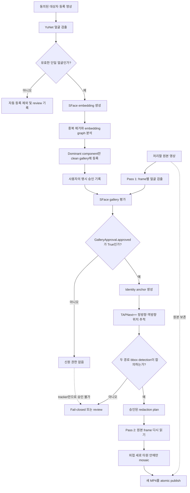

# Consented Face Redactor

동의받은 특정 인물의 얼굴을 등록 영상에서 로컬 gallery로 구성하고, 별도의 FHD 영상에서 그 인물의 얼굴에만 모자이크를 적용하는 Python Vision AI 프로젝트입니다.

OpenCV YuNet으로 얼굴을 찾고, SFace와 명시적 gallery approval로 대상자를 확인합니다. 선택적 TAPNext++ 경로는 승인된 얼굴 위치만 시간축으로 연결합니다. tracker confidence나 detector confidence만으로는 사람을 구별하지 않습니다.

> 현재 상태: 제공된 1080×1920·30fps·456 frame 테스트 영상에서 clean enrollment와 TAPNext++ 양방향 합의를 사용해 456/456 frame을 처리했습니다. 이 결과는 해당 로컬 영상의 관측값이며 임의 영상에 대한 절대 정확도 보장은 아닙니다.

## 주요 기능

- 대상자만 등장하는 등록 영상에서 다양한 얼굴 각도의 embedding reference 생성
- embedding graph의 dominant component를 사용한 잘못된 얼굴 crop 격리
- `GalleryApproval.approved=True`만 신원 권한으로 사용하는 fail-closed pipeline
- frame-by-frame 경량 모드와 TAPNext++ 2-pass 시간축 모드
- bbox를 외접하는 완만한 세로 타원형 adaptive mosaic
- 원본을 덮어쓰지 않는 별도 MP4 출력과 atomic publish
- model manifest 및 SHA-256 검증
- 민감한 frame, crop, embedding을 포함하지 않는 JSON evidence
- 설정 schema migration, strict opt-in, 321개 자동 테스트와 A–E benchmark

## 빠른 설치와 검증

Python 3.12 이상이 필요합니다.

```powershell
git clone <YOUR_REPOSITORY_URL>
cd consented-face-redactor

python -m venv .venv
.\.venv\Scripts\Activate.ps1
python -m pip install --upgrade pip
pip install -e ".[dev,inference]"
```

설치 후 synthetic 테스트와 benchmark는 실제 얼굴·모델 파일 없이 실행할 수 있습니다.

```powershell
pytest -q

python -c "from consented_face_redactor.benchmark import run_benchmark; print(run_benchmark(category='A'))"

python -c "import json; from consented_face_redactor.benchmark import generate_aggregate_report; report=json.loads(generate_aggregate_report()); print(report['total_passed'], report['total_all'])"
```

검증된 현재 기준은 `321 passed`, aggregate `24/24`입니다.

## 실제 영상 실행

### 1. 로컬 전용 자료 배치

모델, 얼굴 영상, gallery, approval, evidence, 출력 영상은 저장소에 포함하지 않습니다. 프로젝트 루트에 다음 구조를 직접 만드세요. `local-assets/` 전체는 `.gitignore`로 제외됩니다.

```text
local-assets/
  input/
    learn.mp4                       # 목표로 하는 대상자만 등장하는 등록 영상
    test.mp4                        # 처리할 영상
  models/
    face_detection_yunet_2023mar.onnx
    face_recognition_sface_2021dec.onnx
    tapnextpp_512.ckpt              # tracker 사용 시에만 필요
  manifests/
    face-models.json
  gallery/
    profiles.json                   # 등록 후 생성
    approvals.json                  # 명시 승인 후 생성
  vendor/
    tapnet/                         # 공식 google-deepmind/tapnet checkout
  evidence/
  output/
```

모델은 자동 다운로드하지 않습니다. 각 모델의 출처와 라이선스를 확인해 사용자가 직접 확보해야 합니다. manifest 작성 형식은 [examples/model_manifest.example.json](examples/model_manifest.example.json)을 참고하세요. 예제 hash는 이 프로젝트의 실제 검증에서 사용한 공식 파일 기준이며, 보유 파일의 SHA-256과 반드시 대조해야 합니다.

TAPNext++를 사용할 경우 tracking 의존성도 설치합니다.

```powershell
pip install -e ".[tracking]"
```

### 2. 모델 무결성 검증

```powershell
consented-face-redactor validate-models `
  --manifest-dir .\local-assets\manifests `
  --model-dir .\local-assets\models
```

manifest의 filename, role, provider, SHA-256이 실제 파일과 맞지 않으면 처리를 시작하지 않습니다.

### 3. 등록 영상 dry-run

먼저 gallery를 변경하지 않고 후보와 격리 통계를 확인합니다.

```powershell
consented-face-redactor gallery-enroll-video `
  --input .\local-assets\input\learn.mp4 `
  --gallery-db .\local-assets\gallery\profiles.json `
  --approval-db .\local-assets\gallery\approvals.json `
  --model-dir .\local-assets\models `
  --manifest-dir .\local-assets\manifests `
  --sample-every-n-frames 6 `
  --max-references 64 `
  --minimum-cluster-similarity 0.45 `
  --dry-run `
  --report-out .\local-assets\evidence\enrollment-dry-run.json
```

`learn.mp4`에는 승인할 대상자만 등장해야 합니다. 그 경우에도 detector가 귀나 부분 얼굴을 잘못 검출할 수 있으므로 dry-run의 selected/review 통계를 먼저 확인해야 합니다.

### 4. gallery 생성과 명시 승인

dry-run 결과를 검토한 뒤에만 `--approve`를 사용합니다.

```powershell
consented-face-redactor gallery-enroll-video `
  --input .\local-assets\input\learn.mp4 `
  --gallery-db .\local-assets\gallery\profiles.json `
  --approval-db .\local-assets\gallery\approvals.json `
  --model-dir .\local-assets\models `
  --manifest-dir .\local-assets\manifests `
  --sample-every-n-frames 6 `
  --max-references 64 `
  --minimum-cluster-similarity 0.45 `
  --approve `
  --approval-reason "consented_local_enrollment" `
  --report-out .\local-assets\evidence\enrollment.json
```

### 5. 가벼운 frame-by-frame 처리

tracker 없이 실행하면 얼굴별 gallery 승인을 매 frame 다시 평가합니다. 계산량은 적지만 각도 변화가 큰 영상에서는 모자이크가 끊길 수 있습니다.

```powershell
consented-face-redactor process-video `
  --input .\local-assets\input\test.mp4 `
  --output .\local-assets\output\test-redacted-light.mp4 `
  --model-dir .\local-assets\models `
  --manifest-dir .\local-assets\manifests `
  --gallery-db .\local-assets\gallery\profiles.json `
  --approval-db .\local-assets\gallery\approvals.json `
  --tracker none `
  --evidence-out .\local-assets\evidence\test-light.json
```

### 6. TAPNext++ 양방향 처리

저장 영상의 시간축 연속성이 중요하면 2-pass tracker 경로를 사용합니다. tracker는 명시 승인 anchor의 위치만 연결하며 새로운 신원 권한을 만들지 않습니다.

```powershell
consented-face-redactor process-video `
  --input .\local-assets\input\test.mp4 `
  --output .\local-assets\output\test-redacted-tapnextpp.mp4 `
  --model-dir .\local-assets\models `
  --manifest-dir .\local-assets\manifests `
  --gallery-db .\local-assets\gallery\profiles.json `
  --approval-db .\local-assets\gallery\approvals.json `
  --tracker tapnextpp `
  --tracker-source-dir .\local-assets\vendor\tapnet `
  --tracker-checkpoint .\local-assets\models\tapnextpp_512.ckpt `
  --tracker-device cuda `
  --tracking-mode bidirectional `
  --tracker-max-gap-frames 90 `
  --tracker-minimum-path-iou 0.30 `
  --tracker-minimum-visible-ratio 0.60 `
  --evidence-out .\local-assets\evidence\test-tapnextpp.json
```

실제 평가 목적으로 bbox까지 evidence에 넣어야 할 때만 `--evaluation-evidence`를 추가하세요. 기본 evidence에는 frame pixel, 얼굴 crop, embedding vector가 포함되지 않습니다.

### 7. 원본 오디오 보존

FFmpeg가 설치돼 있다면 다음 옵션을 처리 명령에 추가할 수 있습니다.

```powershell
  --preserve-audio `
  --ffmpeg-path C:\Tools\ffmpeg.exe
```

FFmpeg remux가 성공한 뒤에만 최종 destination을 생성합니다. 현재 검증 환경에는 FFmpeg executable이 없어 실제 v4 결과는 video stream만 검증했습니다.

## 기본 처리 구조

```text
등록 영상
  → YuNet detection
  → SFace embedding
  → dominant embedding component
  → LocalGallery + ApprovalStore

대상 영상
  → frame별 detection/gallery 평가
  → GalleryApproval.approved=True anchor
  → TAPNext++ forward/backward tracking
  → bbox 합의 + detection association
  → 승인된 redaction plan
  → 외접 세로 타원 adaptive mosaic
  → 새 MP4 파일
```

### 한눈에 보는 전체 흐름



이 흐름에서 사람의 구분점을 만드는 유일한 지점은 `GalleryApproval.approved=True`입니다. YuNet은 위치 후보, SFace similarity는 gallery 관측, TAPNext++는 승인된 위치의 시간적 연속성, mosaic renderer는 최종 표현만 담당합니다.

### 신원 승인 경계

- detector confidence가 높다는 이유만으로 모자이크하지 않습니다.
- similarity, `t_confirm`, `t_keep`은 telemetry이며 독립 권한 신호가 아닙니다.
- gallery 오류, empty gallery, malformed return, 미승인 profile은 fail-closed입니다.
- tracker visibility는 위치 품질일 뿐 identity approval이 아닙니다.
- 같은 frame의 여러 얼굴은 각각 독립적으로 승인합니다.

## 기본 모자이크 설정

현재 Config schema는 v4입니다.

| 필드 | 기본값 | 의미 |
| --- | ---: | --- |
| `mosaic_shape` | `"ellipse"` | bbox를 외접하는 세로 타원 mask |
| `mosaic_grid_cells` | `12` | 얼굴 짧은 변의 mosaic grid 수 |
| `mosaic_min_block_px` | `10` | 최소 block 크기 |
| `mosaic_ellipse_horizontal_scale` | `1.40` | bbox 반폭 대비 가로 반축 |
| `mosaic_ellipse_vertical_scale` | `1.50` | bbox 반높이 대비 세로 반축 |
| `mosaic_padding_ratio` | `0.18` | rectangle 호환 모드에서만 사용 |

예제 설정은 [examples/config.example.json](examples/config.example.json), 전체 계약은 [docs/CONFIG_SCHEMA.md](docs/CONFIG_SCHEMA.md)를 확인하세요.

## 프로젝트 구조

```text
consented-face-redactor/
  README.md                    # GitHub 첫 화면: 설명과 실행 방법
  pyproject.toml               # 패키지·의존성·CLI 설정
  examples/                    # 공개 가능한 설정/manifest 예제
  src/consented_face_redactor/
    adapters/                  # YuNet/SFace 및 외부 모델 경계
    benchmark/                 # synthetic A–E benchmark
    domain/                    # FaceBox, MosaicConfig 등 도메인 타입
    effects/                   # mosaic/sticker renderer
    media/                     # 선택적 FFmpeg remux
    tracking/                  # TAPNext++, geometry, association, authorization
    approved_gallery.py        # embedding match와 명시 승인 결합
    gallery_approval.py        # 불변 GalleryApproval 계약
    pipeline.py                # frame별 안전 상태 머신
    temporal_video_processor.py# 2-pass 분석·렌더링
    video_enrollment.py        # 등록 영상 reference 선택
  tests/                       # unit/integration/e2e tests
  docs/                        # 설계·실행·검증·포트폴리오 문서
```

## 문서

- [전체 문서 인덱스](docs/README.md)

### 사용과 계약

- [실제 영상 테스트 가이드](docs/REAL_VIDEO_TEST_GUIDE.md)
- [설정 schema](docs/CONFIG_SCHEMA.md)
- [함수별 코드베이스 설명](docs/CODEBASE_FUNCTION_REFERENCE.md)
- [보안·데이터 정책](docs/SECURITY_AND_DATA_POLICY.md)
- [benchmark protocol](docs/PHASE10_BENCHMARK_PROTOCOL.md)

### 설계와 검증

- [전체 시스템 아키텍처 가이드](docs/architecture/SYSTEM_ARCHITECTURE_GUIDE.md)
- [전체 처리 및 권한 흐름도](docs/architecture/PROJECT_FLOWCHART.md)
- [등록 영상 구현 명세](docs/VIDEO_REFERENCE_ENROLLMENT_IMPLEMENTATION_SPEC.md)
- [TAPNext++ 작업지시서](docs/TEMPORAL_TRACKING_AND_STRONG_MOSAIC_WORK_ORDER.md)
- [TAPNext++ 구현 및 실제 영상 검증 보고서](docs/TEMPORAL_TRACKING_IMPLEMENTATION_REPORT.md)
- [로컬 실제 모델 구현 보고서](docs/LOCAL_REAL_MODEL_IMPLEMENTATION_REPORT.md)

### 포트폴리오

- [상세 프로젝트 포트폴리오 사례 연구](docs/portfolio/PROJECT_PORTFOLIO_CASE_STUDY.md)

포트폴리오 문서는 문제 발견, 실패, 원인 분석, 버전별 개선, 함수 책임, 설계 근거와 한계를 자세히 설명하는 별도 문서입니다. GitHub 첫 화면의 실행 안내와 분리해 유지합니다.

## 검증된 결과와 한계

```text
pytest: 321 passed
Benchmark A: 9/9
Benchmark B: 5/5
Benchmark C: 5/5
Benchmark D: 2/2
Benchmark E: 3/3
Aggregate: 24/24
```

- 실제 456/456 결과는 제공된 단일 대상 영상에 대한 관측입니다.
- 다중 인물 교차, 장시간 완전 가림, 재등장 영상은 추가 검증이 필요합니다.
- TAPNext++ 경로는 현재 실시간 30fps보다 느리며 저장 영상 batch 처리에 적합합니다.
- 모델, tracker source, checkpoint는 저장소에서 자동으로 받지 않습니다.
- 이 프로젝트는 동의한 인물의 로컬 비식별화용이며 감시, 무단 신원 확인, face swap 용도가 아닙니다.

## 라이선스

이 저장소는 [Portfolio Viewing License 1.0](LICENSE)으로 공개합니다. GitHub에서 포트폴리오를 열람·평가하고 링크하거나 출처를 표시한 짧은 인용을 하는 것은 허용하지만, 별도 서면 허가 없는 복사·수정·재배포·상업적 사용·production 배포·모델 학습 데이터 사용은 허용하지 않습니다. 외부 모델과 TAPNext++에는 각각의 원 출처 라이선스가 적용됩니다.
