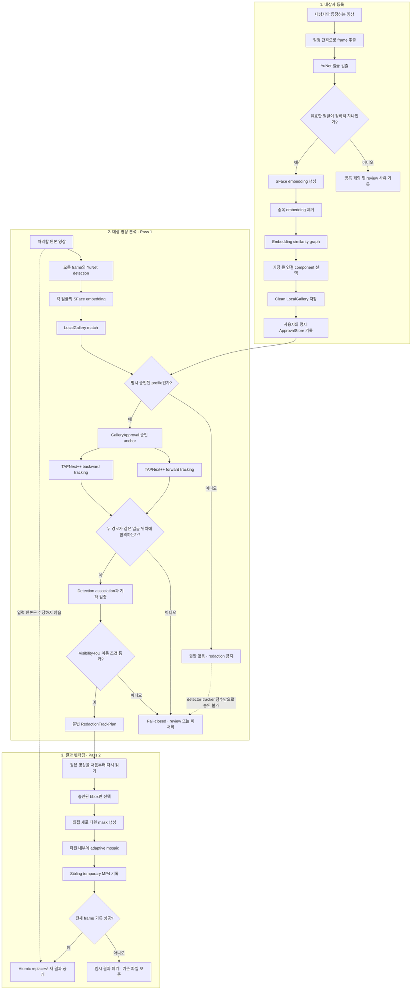
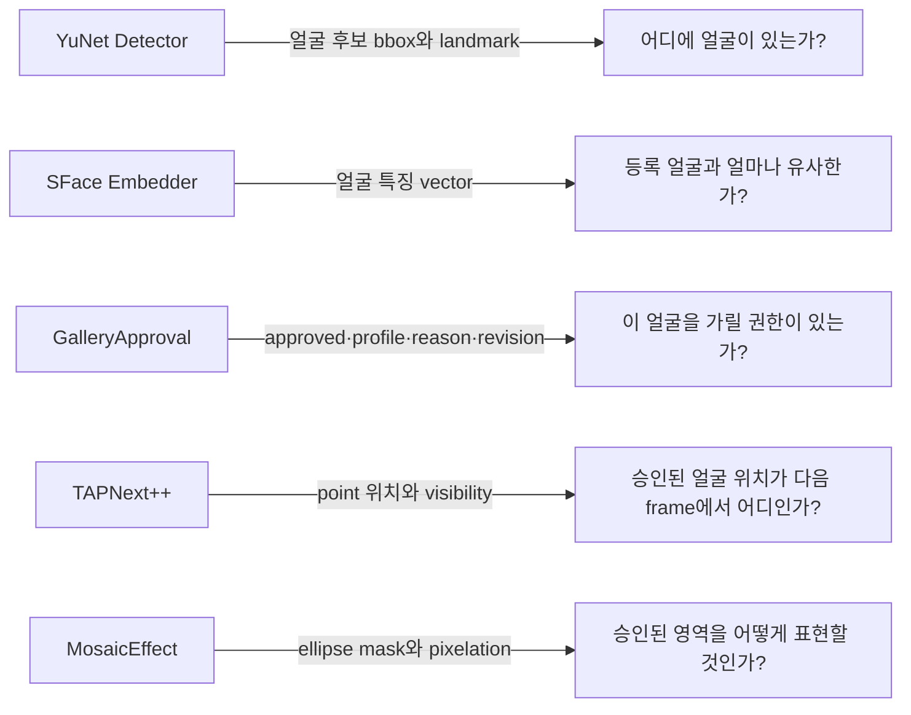
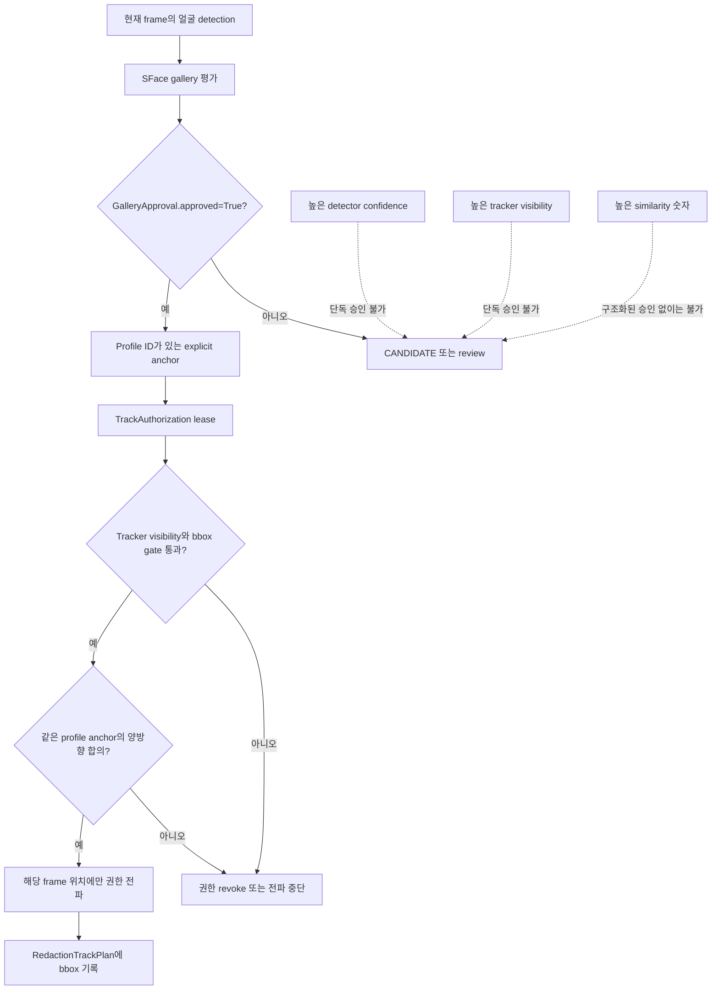
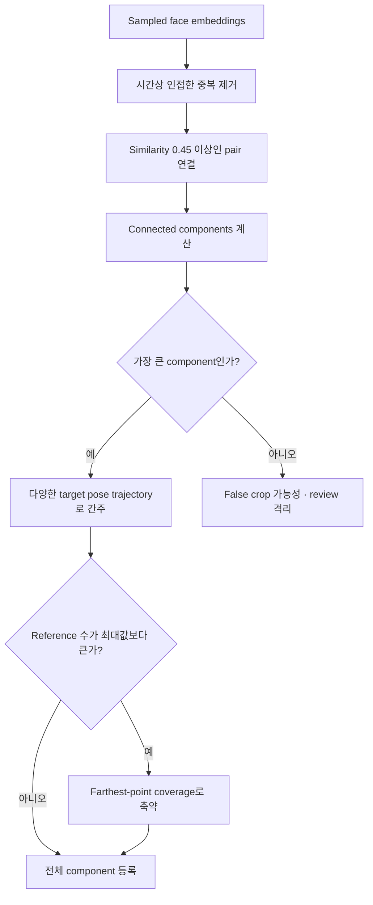
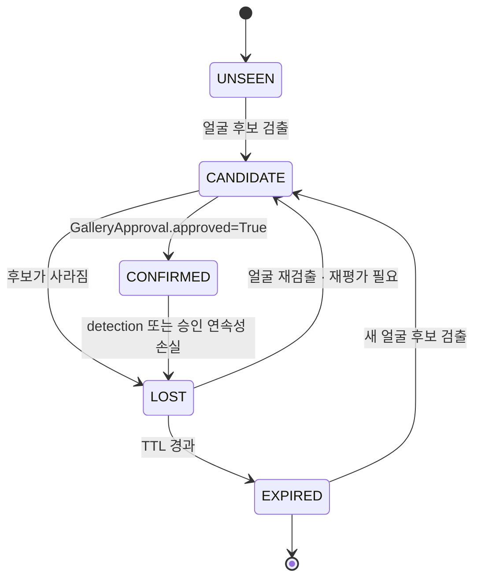
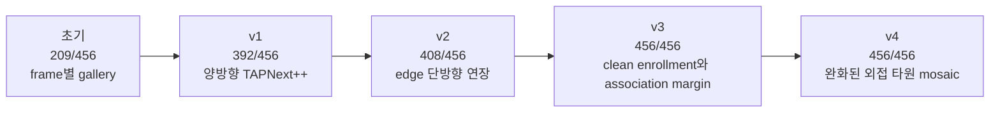

# Consented Face Redactor 시각적 흐름도

이 문서는 프로젝트를 처음 보는 사람이 “어떤 자료가 들어오고, 어떤 판단을 거쳐, 무엇이 결과로 나오는가”를 빠르게 이해하기 위한 시각 자료다.

## 1. 전체 시스템 한눈에 보기

## 2. 각 AI 구성요소가 답하는 질문

가장 중요한 구분은 `유사하다`와 `승인됐다`가 같지 않다는 점이다. similarity는 gallery 판단에 사용되는 관측값이고, pipeline이 소비하는 최종 권한은 구조화된 `GalleryApproval.approved=True`뿐이다.

## 3. 사람 구별 결과가 전달되는 방식

## 4. 등록 오염을 막는 흐름

실제 등록 영상에서는 47개 후보가 36개의 dominant component, 9개의 별도 component, 2개의 singleton으로 분리됐다. 귀 주변 false crop을 포함한 11개 후보를 자동 등록하지 않고 review로 격리했다.

## 5. 상태 머신

frame-by-frame 경량 경로의 상태는 다음과 같다.

`LOST` 상태는 이전 승인 사실을 기억할 수 있지만 얼굴을 계속 가리는 권한은 아니다. 재등장한 얼굴은 gallery 또는 temporal plan의 검증된 근거가 필요하다.

## 6. 버전별 개선 흐름

숫자만 개선한 것이 아니다. v3 이전 contact sheet에서 귀 부분 false crop을 발견했고, gallery 오염을 제거한 뒤에야 456/456을 최종 결과로 인정했다.
